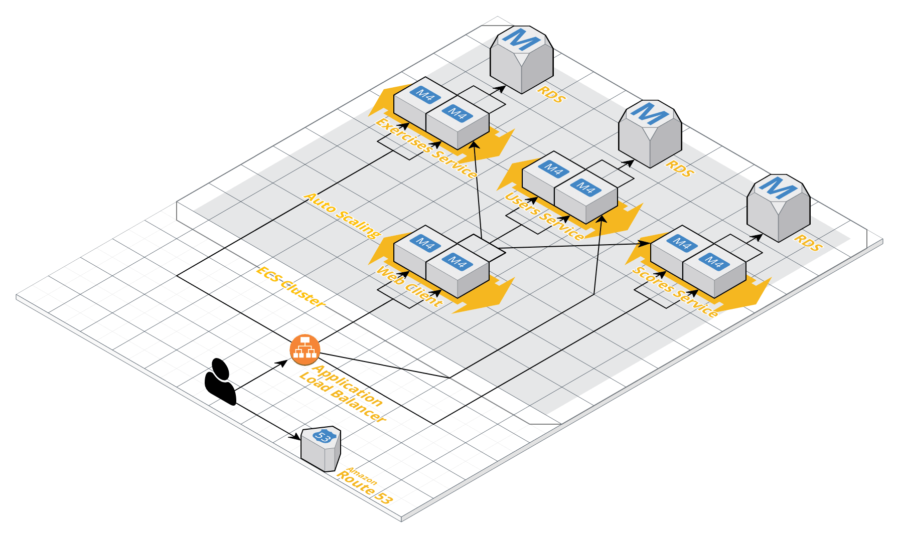

# Codecheck

## Overview
Codecheck is a coding exercise app to test your Python knowledge. You can try it out at https://codecheck.tech.

## Architecture
### Backend
* Python + Flask
* Postgres RDS for data store
* `unittest` for test coverage
* `flake8` for linting

### Frontend
* React app
* `jest` for unit tests
* `cypress` for end-to-end tests

### Infrastructure
* Docker and ECR for containerization
* ELB for load balancing
* ECS for orchestration and auto scaling
* Travis for CI/CD

